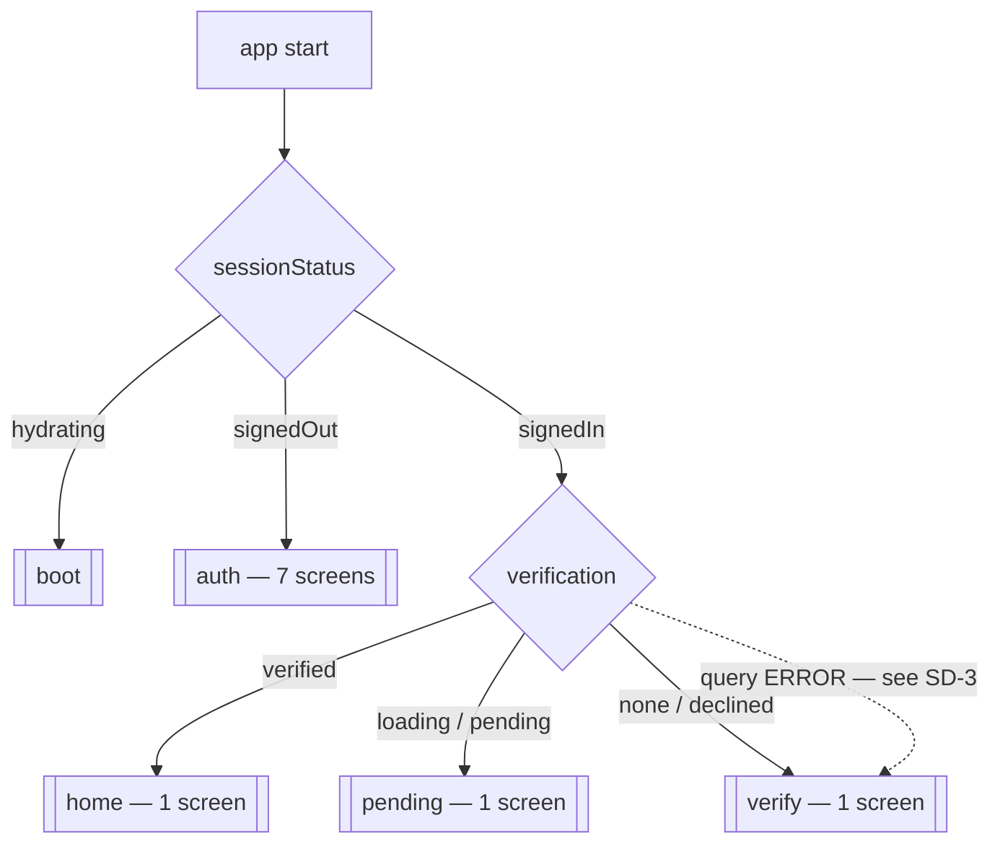
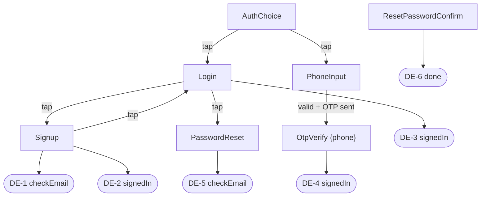

# FLOWS.md — what the app actually does today

**Purpose:** The as-built map of every screen, transition and dead end, derived from source.
**Date:** 2026-08-08 (Day 9). **Branch:** `chore/integrate-auth-db-persona` @ `4ccfc9a`.
**For:** Track B1. The companion target design is [`system-design-ux/USER_FLOWS.md`](system-design-ux/USER_FLOWS.md).

---

## How to read this file

This document describes **what the code does**, not what the product should do. Every claim carries
a `file:line` that was opened and checked, not inferred. Where a flow is broken, this file records
the break and links to the target flow that fixes it — it does **not** propose the fix.

> **Do not read this as a design.** "There is a flow for X" here means "the code does X today",
> which is frequently "X strands the user". The design lives in the companion document.

**Rendered diagrams:** [`system-design-ux/flows.html`](system-design-ux/flows.html) — open in a
browser. Same content, UML activity notation with swimlanes, no build step.

---

## 1. The gate

Five **mutually exclusive** navigators. This is the whole navigation model — there is no tab bar,
no nested navigator, and no modal route anywhere in the app.



`selectStack(sessionStatus, verification)` — `src/app/navigation.tsx:76-96`:

| `sessionStatus` | `verification` | stack | line |
|---|---|---|---|
| `hydrating` | *(any)* | `boot` | `:80-82` |
| `signedOut` | *(any)* | `auth` | `:83-85` |
| `signedIn` | `verified` | `home` | `:86-88` |
| `signedIn` | `loading` | `pending` | `:89-91` |
| `signedIn` | `pending` | `pending` | `:89-91` |
| `signedIn` | `none` | `verify` | `:95` |
| `signedIn` | `declined` | `verify` | `:95` |

The ordering is deliberate and documented in-source at `:70-74`: `hydrating` wins over everything;
`signedOut` wins over verification; and **only an explicit `verified` reaches home** — `loading` does
not. Unknown is never treated as verified. That ordering is correct and should not be changed.

**Separate stacks rather than one gated stack is also deliberate** (`:109-112`): a screen that is not
registered cannot be reached by a stale `navigate()`, a bug, or a deep link. The consequence for this
document is that **every transition between the five boxes above is implicit** — no screen navigates
across a stack boundary, because the target route does not exist in the mounted navigator. Stack
changes happen only when `useSessionStore` or `useVerificationStatus` changes value and
`RootNavigator` re-renders.

The gate is **UX, not security** (`:114-123`). `issue-device-session` re-reads `age_verified`
server-side; a patched client can render Home and still obtain no session key.

---

## 2. Routes

`RootStackParamList` — `navigation.tsx:25-39`. Ten routes; only one takes a param.

| Route | Component | Stack | Params | Registered |
|---|---|---|---|---|
| `AuthChoice` | `AuthMethodChoiceScreen` | auth *(initial)* | — | `:139-143` |
| `Signup` | `SignupScreen` | auth | — | `:144` |
| `Login` | `LoginScreen` | auth | — | `:145` |
| `PhoneInput` | `PhoneInputScreen` | auth | — | `:146` |
| `OtpVerify` | `OtpEntryScreen` | auth | `{ phone: string }` | `:147` |
| `PasswordReset` | `PasswordResetRequestScreen` | auth | — | `:148` |
| `ResetPasswordConfirm` | `ResetPasswordConfirmScreen` | auth | — | `:149` |
| `Home` | `HomeScreen` | home | — | `:153` |
| `VerificationPending` | `BootSplash` | **boot** | — | `:135` |
| `VerificationPending` | `VerificationPendingScreen` | **pending** | — | `:157` |
| `VerifyAge` | `PersonaVerificationScreen` | verify | — | `:161-165` |

The last three rows are not a typo — see **SD-1**.

### 2.1 Every navigation call in the app

Verified exhaustively (`grep 'navigation\.navigate('` across `src/`, tests excluded). **Six call
sites, in four files.** There are **zero** calls to `replace`, `reset`, `goBack`, `push` or `popTo`
anywhere in `src/`.

| # | From | Line | To | Guard |
|---|---|---|---|---|
| 1 | `AuthMethodChoiceScreen` | `:28` | `Login` | none — tap |
| 2 | `AuthMethodChoiceScreen` | `:37` | `PhoneInput` | none — tap |
| 3 | `LoginScreen` | `:150` | `PasswordReset` | none — tap |
| 4 | `LoginScreen` | `:175` | `Signup` | none — tap |
| 5 | `SignupScreen` | `:201` | `Login` | none — tap |
| 6 | `PhoneInputScreen` | `:76` | `OtpVerify` `{phone}` | valid number **and** `requestPhoneOtp` ok |

**Only call site 6 is a success transition.** Every other navigation in the app is a user tapping a
link between two forms. This single fact generates most of section 4: no screen moves the user
forward when their action succeeds, so every success state had to be drawn as a terminal panel, and
every one of those panels depends on the navigator swapping the stack out from underneath it.



---

## 3. State sources

**`useSessionStore`** — `src/app/stores/useSessionStore.ts`. `SessionStatus = 'hydrating' |
'signedOut' | 'signedIn'` (`:5`), initial `hydrating` (`:25-29`). Transitions live entirely in
`initSessionListener()` (`:46-80`), called once from `App.tsx:12-14`:

- missing/invalid Supabase env → warn, force `signedOut` (`:52-63`). Fails **open to signedOut**, so
  the app can never wedge on the boot splash.
- `getSession()` resolves → `signedIn` if a session exists, else `signedOut` (`:65-71`).
- `onAuthStateChange` → same mapping, on every sign-in, sign-out, token refresh and Keychain
  restore (`:73-79`).

The store never signs anyone in or out itself; auth actions go through `AuthClient`.

**`useVerificationStatus`** — `src/features/verification/useVerificationStatus.ts`.
`VerificationState = 'loading' | 'none' | 'pending' | 'verified' | 'declined'`.

- Reads the user's own latest `verifications` row: `select('age_verified, provider_status')
  .order('verified_at' desc).limit(1).maybeSingle()` (`:77-85`). RLS scopes it. `inquiry_id` is
  deliberately **not** selected (`:79-81`) — pulling it into client memory beside the signed-in user
  is exactly what inviolable rule 1 prohibits. That is correct and should stay.
- `toState` (`:51-64`): no row → `none`; `age_verified` → `verified`; `provider_status` null or
  `'pending'` → `pending`; anything else → `declined`. A status we do not have yet is never a pass.
- Polls every **5 s**, and only while the state is `pending` (`:44`, `:74`). No timeout, no backoff,
  no attempt ceiling.
- Returns `error` and `refetch` (`:100-101`) — see **SD-3**.

---

## 4. Dead ends — DE-1 … DE-8

The Definition of Done (spec §12.1) requires *"error states have a user-visible recovery path"*.
**It is unmet in eight places.** Each entry below is a rendered state with **no button, no link and
no navigation** — the user's only in-screen affordance is the native header back arrow, and three of
these screens are on stacks where `headerShown: false`.

| ID | File:line | State | What the user sees | Why there is no exit | Fixed by |
|---|---|---|---|---|---|
| **DE-1** | `auth/SignupScreen.tsx:94-103` | `checkEmail` | "Check your email / We sent a confirmation link to finish creating your account." | Form is unmounted. No resend, no change-address, no back link. **And no custom SMTP is configured**, so the email that this panel waits for may never arrive. | [F2](system-design-ux/USER_FLOWS.md#f2) |
| **DE-2** | `auth/SignupScreen.tsx:105-112` | `signedIn` | "Account created / You're signed in." | No navigation. Depends entirely on `onAuthStateChange` firing and the navigator swapping stacks. If it does not fire, this is permanent. | [F2](system-design-ux/USER_FLOWS.md#f2) |
| **DE-3** | `auth/LoginScreen.tsx:92-98` | `signedIn` | "Signed in" | Same shape as DE-2. | [F4](system-design-ux/USER_FLOWS.md#f4) |
| **DE-4** | `auth/OtpEntryScreen.tsx:99-107` | `signedIn` | "Signed in" | Same shape — and this file imports **no** `useNavigation` at all, so there is no way back to `PhoneInput` to correct a mistyped number either. | [F3](system-design-ux/USER_FLOWS.md#f3) |
| **DE-5** | `auth/PasswordResetRequestScreen.tsx:81-90` | `checkEmail` | "Check your email / If an account exists for that address, we sent a link…" | Terminal. The file contains **zero** navigation calls. *(The deliberately non-committal wording is correct — it must not reveal whether an account exists. Keep it.)* | [F5](system-design-ux/USER_FLOWS.md#f5) |
| **DE-6** | `auth/ResetPasswordConfirmScreen.tsx:88-95` | `done` | "Password updated / You can now log in with your new password." | Tells the user to log in, then offers no way to. No navigation calls in the file. Compounded by **SD-2**. | [F5](system-design-ux/USER_FLOWS.md#f5) |
| **DE-7** | `verification/PersonaVerificationScreen.tsx:88-95` | `canceled` | "Verification not completed / **You can try again whenever you're ready.**" | The copy promises a retry the screen does not provide. The Persona modal launches once per mount, guarded by a `started` ref (`:33`, `:36-39`), so it cannot relaunch. Nothing unmounts the screen. | [F6](system-design-ux/USER_FLOWS.md#f6) |
| **DE-8** | `devices/HomeScreen.tsx:50-61` | *(whole screen)* | Spinner + "Confirming your verification… We're waiting on the result." | No buttons at all. Its stack sets `headerShown: false` (`navigation.tsx:156`), so there is not even a back arrow. See §5 for why this can wait forever. | [F6](system-design-ux/USER_FLOWS.md#f6) |

The two remaining terminal panels in `PersonaVerificationScreen` — `not_configured` (`:67-74`) and
the `error` fallthrough (`:97-102`) — have the same shape. They are excluded from the register only
because `not_configured` is a developer-environment state and the `error` panel's copy does not
promise something it fails to deliver. Both still need a recovery path in F6.

### 🔴 4.1 The trap: a declined user cannot leave

This is not one of the eight. It is worse, because no single screen is wrong.

**Sign-out exists in exactly one place in the app** — `devices/HomeScreen.tsx:31-41`, on the `home`
stack. The source comment at `:10-11` states the intent plainly: *"the one thing it must get right
today is sign-out, because that is the only way back out of the gated stack."*

That escape hatch is on the **only stack a blocked user cannot reach**. Trace it:

1. User signs in. `sessionStatus = 'signedIn'`.
2. Verification is declined → `useVerificationStatus` returns `declined`.
3. `selectStack` returns `verify` (`navigation.tsx:95`).
4. The `verify` stack contains one screen, `PersonaVerificationScreen`, which has no sign-out, no
   support route, and — per DE-7 — no working retry.
5. `sessionStatus` is still `signedIn`, so the auth stack is not mounted. There is no route to it.

**The user is now permanently inside the app with no exit and no way to contact anyone.** Force-quit
and relaunch reproduces the identical state, because the session is restored from the Keychain. The
same trap applies to the `pending` stack (DE-8) once a row exists.

Reaching this state today requires a seeded row, because §5 explains no row is ever written. **That
is the only reason this has not been hit.** It is a shipping blocker, and it is a flow defect rather
than a code defect: no individual screen is missing a button so much as the gated stacks are missing
a universal escape. Resolved by [F9](system-design-ux/USER_FLOWS.md#f9).

---

## 5. What is actually reachable today

```
boot → auth (7 screens, all real) → verify → PersonaVerificationScreen → stops
```

`home` is reachable **only** with a manually seeded `verifications` row. `pending` is not reachable
at all. The chain that breaks it:

1. `PersonaVerificationScreen` launches `Inquiry.fromTemplate(config.templateId)` client-side
   (`:50-56`). This carries **no user linkage** — no `reference-id`, no `user_id`.
2. The callbacks set local component state only: `onComplete → 'pending'`, `onCanceled → 'canceled'`,
   `onError → 'error'` (`:52-54`). Nothing is written anywhere.
3. So **no `verifications` row is ever created**. `useVerificationStatus` returns `none` forever, and
   `selectStack` returns `verify` forever.
4. `create-inquiry` — the Edge Function that would create the row server-side — returns **501
   `NOT_IMPLEMENTED`** (`supabase/functions/create-inquiry/index.ts:102-105`). Its comment at `:94`
   says why the stub is a 501 rather than something plausible: to keep the gap visible.
5. `persona-webhook` is fully implemented, but returns **404 `UNKNOWN_INQUIRY`** for an inquiry it
   has no row for — which is every inquiry the app currently creates.

**No app code calls any Edge Function.** `grep 'functions.invoke' src/` returns zero hits, so
`issue-device-session` has never run from the client and `K_sess` has never entered the app.

This is by design for increment 1 (spec §6.1): the client-initiated flow proves capture works and
**must never gate anything**. The SDK's `onComplete` is a UI hint (inviolable rule 3). Increment 2
(`P2-8.0`) makes the backend the only writer of verification state.

---

## 6. Structural defects — SD-1 … SD-3

Distinct from dead ends: these are navigator and state-plumbing bugs, not missing recovery paths.

**SD-1 — one route name, two components.** `VerificationPending` is registered in the `boot` stack
bound to `BootSplash` (`navigation.tsx:135`) and in the `pending` stack bound to
`VerificationPendingScreen` (`:157`). The stacks are mutually exclusive so nothing misbehaves at
runtime, but the name now means two different things, and a future `navigate('VerificationPending')`
would land somewhere that depends on invisible state. It also makes `RootStackParamList:36` ambiguous
about which screen it types.

**SD-2 — the reset-password deep link probably cannot arrive.** `linking` registers exactly one
route, `ResetPasswordConfirm` (`navigation.tsx:47-57`), and the native side is wired
(`ios/BlueSmoke/Info.plist`, `android/app/src/main/AndroidManifest.xml`). But that route exists
**only in the auth stack**, which is mounted only while `signedOut`. Opening a Supabase recovery link
establishes a recovery session → `onAuthStateChange` fires → `sessionStatus` flips to `signedIn` →
`selectStack` leaves the auth stack. The deep link's target is unmounted at, or immediately after,
the moment it is needed. **Unverified against a real device** — the exact ordering of link delivery
vs. session establishment decides it, and nobody has run the flow end to end. Flagged as suspected,
not proven, and it is the first thing to test once Track A lands.

**SD-3 — a network error is rendered as "never verified".** `useVerificationStatus` returns
`query.isPending ? 'loading' : (query.data ?? 'none')` (`:95`). On a **query error**, `isPending` is
`false` and `data` is `undefined`, so the hook returns `'none'` — and `selectStack` sends the user
into the Persona SDK. A dropped connection is indistinguishable from having never verified, and a
verified user on a flaky network is asked to scan their ID again.

The hook already anticipated this. It exports `error` and `refetch` with the comment (`:96-99`):
*"Surfaced so the caller can offer a retry. Errors here are transport failures, never a verification
decision — a failed fetch must never be rendered as 'declined'."* The affordance is correct and was
built. **`RootNavigator` destructures only `{ state }` (`navigation.tsx:126`) and drops both.**
So the fix is small: consume what is already returned. Resolved by
[F6](system-design-ux/USER_FLOWS.md#f6).

---

## 7. Screens that do not exist

For completeness, because their absence shapes the target design. Verified: `src/features/profile/`,
`src/features/onboarding/` and `src/features/lock/` contain **only `.gitkeep`**.

| Area | State |
|---|---|
| Onboarding / permission priming | **Absent.** `P1-2.0` is 0/9. No runtime permission request exists anywhere in `src/`; Android's permissions are declared in the manifest but never requested. |
| Profile / settings / account | **Absent.** No route, no screen, no file. |
| Device list, scan, pairing | **Absent.** `HomeScreen.tsx:24-29` renders a hard-coded "No devices paired" card with no query behind it. |
| Lock / unlock control | **Absent.** |
| BLE UI | **Absent.** `protocol.ts`, `crypto.ts`, `auth.ts`, `deviceInfo.ts` are implemented and tested, but no screen imports them and `BleClientProvider` is not mounted in `providers.tsx`. `connection.ts:25`, `commands.ts:20` and `proximity.ts:16` are stubs that throw. |
| Dark theme | **Absent.** `tokens.ts` defines `lightTheme` only. |

---

## 8. Design-system adoption

**2 of 10 screens use the UI kit.** `PhoneInputScreen` and `OtpEntryScreen`. The other eight carry
raw hex — including `HomeScreen` and `PersonaVerificationScreen`.

The token-only and contrast guards **do not catch this**: both scan `listSourceFiles('src/shared/ui')`
(`tokenOnlyGuard.test.ts:18`, `contrastCompleteness.test.ts:20`) — the kit directory only. Nothing
under `src/features/**` is scanned, so all eight screens can carry raw hex while CI reports green.

Widening the guard's scope must land **in the same change as** the migration, never before it, or the
build goes red on eight screens and nobody can merge. Full per-screen breakdown and migration order:
[`system-design-ux/SCREEN_INVENTORY.md`](system-design-ux/SCREEN_INVENTORY.md) (Track B2).

---

## 9. Summary

| | |
|---|---|
| Screens | 10 |
| Navigation stacks | 5, mutually exclusive |
| `navigate()` call sites | **6** |
| `replace` / `reset` / `goBack` / `push` | **0** |
| Success transitions | **1** (`PhoneInput → OtpVerify`) |
| Dead ends | **8**, plus the §4.1 trap |
| Structural defects | 3 |
| Edge Function calls from the app | **0** |
| Screens on the design system | 2 of 10 |

**What this file is for.** Sections 4 and 6 are a punch list: eleven items, each with a location and
an owning target flow. None of them is fixed here. Fixing them is a follow-up task, against
[`USER_FLOWS.md`](system-design-ux/USER_FLOWS.md) once it is signed off — which is the right order,
because six of the eight dead ends want the same fix and patching them one screen at a time would
produce six different answers.

**Not yet validated by running the app.** Everything above is read from source. Nobody has walked
this app end to end, because doing so needs the two pending migrations applied and a verified row
seeded (Track A, ~20 min). SD-2 in particular cannot be settled any other way.
