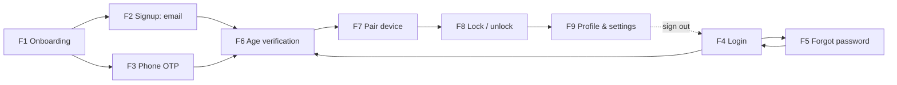
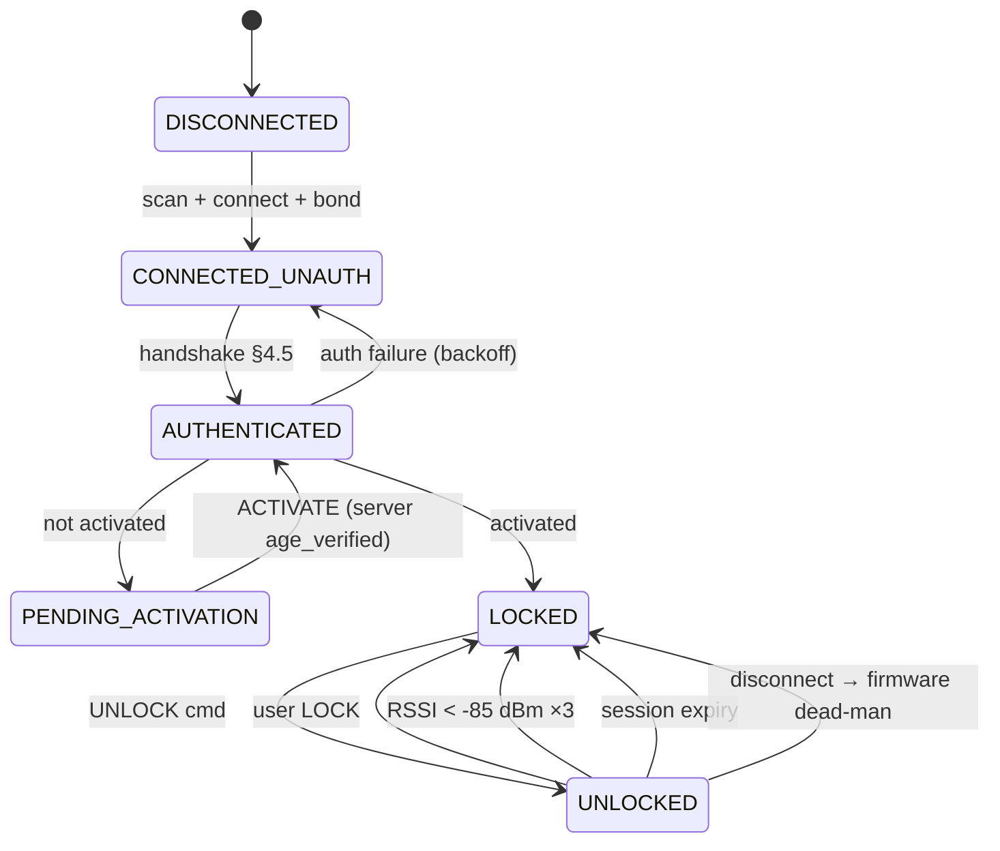

# USER_FLOWS.md — the target user experience

**Purpose:** Every user journey Blue Smoke must support, end to end, including every failure branch
and its recovery. The input to wireframes (`P0-7.0`), onboarding (`P1-2.0`) and the dead-end fixes.
**Date:** 2026-08-08 (Day 9). **Status:** draft for review — not signed off.
**For:** Sadin, Anish, Hardik. Diagrams: [`flows.html`](flows.html) — open in a browser.

---

## How to read this file

This is the **target**. Most of it does not exist yet. For what the code does today, read
[`../FLOWS.md`](../FLOWS.md) — the two are deliberately separate so that "there is a flow for
pairing" is never mistaken for "pairing works".

**Node IDs.** Every step is numbered (`F6.4`). The same IDs appear in `flows.html`. Review comments
should use them: *"F6.4 is wrong — decline should loop to F6.2"*.

**Callout meanings:**

> 🔴 **BLOCKER** — this flow cannot ship until an external answer arrives. Designed anyway, under a
> stated assumption, so the design is not the thing we are waiting on.

> ⚠️ **CONSTRAINT** — an inviolable rule or spec invariant the flow must obey. Not negotiable in
> review.

---

## Design rules these flows obey

Restated as rules rather than prose, because every flow below is checked against them.

1. **Every state has an exit.** No screen may render a state the user cannot leave. This is the
   Definition of Done (§12.1) and it is currently unmet in eight places — see `FLOWS.md` §4.
2. **Sign-out is reachable from every signed-in stack.** Not just `home`. See `FLOWS.md` §4.1.
3. **Verification copy coaches, never diagnoses.** Never a score, never a threshold, never Persona's
   decline reason verbatim, never anything that helps someone game the check. Strings live in
   [`../product/VERIFICATION_COPY.md`](../product/VERIFICATION_COPY.md).
4. **Lock state is notification-driven, never optimistic.** The UI never renders "unlocked" before
   the device says so. A tap moves to a *pending* state and waits.
5. **`age_verified` on the client is a UX hint.** The server re-checks (`issue-device-session`
   §5.4 step 2). Design for the app and server disagreeing.
6. **A transport failure is never rendered as a verification decision.** "We couldn't check" is a
   different screen from "declined", with a different exit.
7. **We design around Persona's SDK, never inside it.** Capture UI is theirs, in their process.
8. **The firmware dead-man timer is the safety authority.** No flow may imply the app must be alive
   for the device to lock.

---

# PART 1 — The journeys

## Journey map

First run is F1 → F2/F3 → F6 → F7. A returning user is F4 → F8. Everything else is recovery.

---

## F1 — Onboarding & permission priming {#f1}

**Lanes:** User · App · OS
**Status:** entirely unbuilt (`P1-2.0`, 0/9). `src/features/onboarding/` holds only `.gitkeep`.
**Entry:** first launch, no session.

### Happy path

| ID | Step |
|---|---|
| F1.1 | Welcome — what the product does, in one screen |
| F1.2 | How it keeps you safe — the device locks itself when your phone leaves range |
| F1.3 | What we do and don't hold — **we never see your ID photo or selfie**; our partner checks it and tells us yes or no |
| F1.4 | → F2 / F3 (auth) |

Three cards, skippable, shown once. F1.3 is not decoration: it is the honest statement of inviolable
rule 1, and it is what makes the ID request in F6 land as reasonable rather than invasive.

### Permission priming

⚠️ **CONSTRAINT — permissions are requested at the moment of need, never at launch.** `P1-2.0`
item 2. A permission dialog on first launch, before the user knows what the app is for, gets denied.

| Permission | Primed at | Flow |
|---|---|---|
| Camera | Start of verification | F6.2 |
| Bluetooth | Start of pairing | F7.1 |
| Notifications | After first successful pair — *"we'll tell you if your device is left unlocked"* | F7.9 |

Each priming screen states **what** we need, **why now**, and **what happens if you say no**, then
triggers the OS dialog. The OS dialog is never the first thing the user sees.

### Denial recovery — F1.D

⚠️ **"Denied once" and "permanently denied" are different screens.** `P1-2.0` items 6-7. The first
can re-prompt; the second cannot, and must deep-link to Settings instead. Getting this wrong produces
a button that silently does nothing — the most confusing possible failure.

| ID | State | Screen | Exit |
|---|---|---|---|
| F1.D1 | Denied once | Explain the consequence, offer "Try again" | Re-triggers the OS dialog |
| F1.D2 | Permanently denied | Explain, "Open Settings" deep link | Settings; state re-checked on foreground |
| F1.D3 | Camera denied | Verification cannot proceed → offer manual fallback (F6.F) | 🔴 OQ-2 |
| F1.D4 | Bluetooth denied | Pairing cannot proceed; **the rest of the app still works** | Back to device list, honest empty state |
| F1.D5 | Bluetooth off (not denied) | Distinct from denied — "Turn on Bluetooth", no permission involved | Re-checks on foreground |

**Permission state is re-checked on every app foreground** (`P1-2.0` item 8). A user who fixes a
permission in Settings must find the app already recovered when they come back — never stuck on the
screen that sent them there.

**F1 is done when every denial combination has been walked and none dead-ends** (`P1-2.0` item 9).

---

## F2 — Signup with email {#f2}

**Lanes:** User · App · Supabase Auth
**Resolves:** DE-1, DE-2.

### Happy path

| ID | Step |
|---|---|
| F2.1 | Enter email, password, confirm password |
| F2.2 | Client validation — `signupSchema`, password ≥ 8 |
| F2.3 | `signUpWithEmail` |
| F2.4 | **Branch on `sessionEstablished`** |
| F2.5 | Session established → F6 |
| F2.6 | Confirmation required → **Check your email** |

### F2.6 — the screen that currently strands people

DE-1 renders a terminal panel and waits for an email. Three things it must gain:

| ID | Affordance | Why |
|---|---|---|
| F2.6a | **Resend** — with a cooldown, mirroring OTP's 30 s | The commonest reason to be on this screen is that the mail did not arrive |
| F2.6b | **Change email address** — back to F2.1, prefilled | A typo is the second commonest, and today it costs a fresh signup |
| F2.6c | **Use phone instead** → F3 | The reliable escape when email is broken. See the note below |

> 🔴 **BLOCKER — no custom SMTP.** Supabase's default mail is rate-limited and unreliable, so today
> the email F2.6 waits for **may never arrive at all**. Until SMTP is configured, F2.6c is not a
> convenience, it is the only working path off this screen. Either configure SMTP or make phone the
> default signup method — a product decision, not a design one.

### F2.5 — success must navigate

DE-2 renders "Account created / You're signed in" and relies on `onAuthStateChange` firing to move
the user. When the listener does fire the panel is a pointless flash; when it does not, the user is
stuck forever. **Success states should not be screens.** Either navigate explicitly, or render
nothing and let the gate move the user. The same applies to DE-3 and DE-4.

### Failures

| ID | Failure | Screen | Recovery |
|---|---|---|---|
| F2.E1 | Validation | Inline field error | Form stays live |
| F2.E2 | Email already registered | Inline | **Offer "Log in instead"** → F4, prefilled |
| F2.E3 | Weak password | Inline, states the rule | Form stays live |
| F2.E4 | Network | Inline banner | Retry; input preserved |

---

## F3 — Signup & login with phone {#f3}

**Lanes:** User · App · Supabase Auth
**Status:** the only flow with a working success transition today (`PhoneInputScreen.tsx:76`).
**Resolves:** DE-4.

| ID | Step |
|---|---|
| F3.1 | Country picker + phone number, formatted live |
| F3.2 | Validate to E.164 |
| F3.3 | `requestPhoneOtp` |
| F3.4 | → OTP entry, `{ phone }` |
| F3.5 | 6 digits, auto-submits on the sixth |
| F3.6 | `verifyPhoneOtp` → F6 |

The existing screen behaviour is good and should be kept: live reformatting per country, clearing the
number when the country changes, auto-submit on the sixth digit, and a 30 s resend cooldown.

### Failures

| ID | Failure | Screen | Recovery |
|---|---|---|---|
| F3.E1 | Invalid for country | Inline | Form stays live |
| F3.E2 | Wrong code | Inline, code cleared | Retype |
| F3.E3 | Expired code | Distinct from wrong — "That code expired" | Resend, cooldown reset |
| F3.E4 | Resend cooldown | Button disabled with visible countdown | Waits |

> 🔴 **The expiry and the cooldown must be chosen together, and currently are not.** Found on dev,
> 2026-08-09: `SMS OTP Expiry` was **60 s** while `OtpEntryScreen.tsx:29`'s resend cooldown is
> **30 s**. A user who misses the SMS therefore has a window where the code is already dead and
> **Resend is still disabled** — F3.E3 becomes the normal path, not an edge case. Raised to 300 s on
> dev. **Prod needs a deliberate number**, and whatever it is, `RESEND_COOLDOWN_SECONDS` has to be
> comfortably below it.
| F3.E5 | **Rate limited** | Honest: "Too many attempts. Try again in N minutes." | **"Use email instead"** → F2 |
| F3.E6 | **Wrong number entered** | — | **"Change number"** → F3.1. Today `OtpEntryScreen` has no `useNavigation` at all (DE-4), so a typo means force-quitting the app |
| F3.E7 | SMS never arrives | Surfaced after the first cooldown expires | Resend · change number · use email |

> **Test numbers only.** The project is on a Twilio trial — real delivery is limited. F3.E7 is
> therefore the *expected* path in development, not an edge case.

---

## F4 — Login with email {#f4}

**Lanes:** User · App · Supabase Auth
**Resolves:** DE-3.

| ID | Step |
|---|---|
| F4.1 | Email + password |
| F4.2 | `signInWithPassword` |
| F4.3 | → the gate (F6 or F7 depending on `age_verified`) |

⚠️ **CONSTRAINT — the error must not enumerate accounts.** "Incorrect email or password" for both
wrong-email and wrong-password. `supabaseAuthClient.ts:33` already does this deliberately; keep it.
Never "no account with that email".

| ID | Failure | Recovery |
|---|---|---|
| F4.E1 | Wrong credentials | Inline, non-enumerating. Password cleared, email kept |
| F4.E2 | Unconfirmed email | → F2.6 with resend |
| F4.E3 | Network | Retry, input preserved |
| F4.E4 | Repeated failures | Surface "Forgot password?" more prominently after 3 |

---

## F5 — Forgot password {#f5}

**Lanes:** User · App · Supabase Auth
**Resolves:** DE-5, DE-6, and SD-2.

| ID | Step |
|---|---|
| F5.1 | Enter email |
| F5.2 | `resetPasswordForEmail`, `redirectTo: bluesmoke://reset-password` |
| F5.3 | **Check your email** — deliberately non-committal about whether the account exists |
| F5.4 | User taps the link → app opens on `ResetPasswordConfirm` |
| F5.5 | New password + confirm |
| F5.6 | `updateUser({ password })` |
| F5.7 | **Password updated → explicit CTA → F4** |

⚠️ Keep F5.3's wording (*"If an account exists for that address…"*). It must not reveal whether the
address is registered. That is a security property, not vague copy.

**F5.3 gains** resend and change-address, same as F2.6 — and the same SMTP blocker applies.

**F5.7 is DE-6.** The screen says "You can now log in with your new password" and offers no way to.
It needs a button. And because `updateUser` on a recovery session leaves the user *signed in*, the
right destination is usually not Login at all — it is the gate. The CTA should read "Continue" and go
wherever `selectStack` sends them.

### F5.S — the deep link may not arrive (SD-2)

`ResetPasswordConfirm` is registered only in the auth stack, which is mounted only while
`signedOut`. Opening the recovery link creates a session → `signedIn` → the auth stack unmounts. The
target of the deep link may be gone at the moment it is needed.

**Unverified.** The ordering of link delivery vs. session establishment decides it, and nobody has
run this on a device. **Test this first once Track A lands.** If confirmed, the fix is to register
`ResetPasswordConfirm` in the gated stacks too, or to handle the recovery event before the gate
re-renders. This flow assumes it will be fixed; the assumption is recorded here rather than hidden.

---

## F6 — Age verification {#f6}

**Lanes:** User · App · **Persona SDK** · Our Backend
**Resolves:** DE-7, DE-8, SD-3, and the §4.1 trap.
**Spec:** §6. Copy: [`../product/VERIFICATION_COPY.md`](../product/VERIFICATION_COPY.md).

> 🔴 **BLOCKER — `min_age` is upstream of this entire flow.** Persona returns `approved` meaning
> *"passed the checks the template was configured with"* — **not** *"is over 18"*. A template with no
> age requirement returns `approved` for a 14-year-old, and every control we build below still
> functions perfectly while the product's core promise silently fails. **No code we write can detect
> this.** Spec §6.6 item 3 / OQ-11. A screenshot of the template's age setting closes it.

⚠️ **CONSTRAINT — the Persona lane is not ours.** ID capture, selfie, liveness and upload happen
inside Persona's SDK, in its own process. We design what *surrounds* it: entry, priming, pending,
pass, decline, cancel, retry, fallback. We must not fetch inquiry payloads, add columns for them,
proxy the SDK's UI, or screenshot it.

### Happy path

| ID | Step | Lane |
|---|---|---|
| F6.1 | **Why we need this** — one screen: 18+ is a legal requirement; our partner checks your ID; we never see the photo | App |
| F6.2 | Camera priming → OS dialog | App / OS |
| F6.3 | `create-inquiry` — server creates the inquiry bound to `user_id`, writes the `pending` row | Backend |
| F6.4 | SDK launches | **Persona** |
| F6.5 | `onComplete` → **Confirming your verification…** | App |
| F6.6 | Persona → webhook → `provider_status` written | Backend |
| F6.7 | App's row poll observes the change | App |
| F6.8 | Verified → F7 | App |

⚠️ **F6.3 must be server-side.** Persona supports a client-set `reference-id`, which would let the
app skip `create-inquiry` entirely. It works — and it lets a client nominate *which user* gets
verified, so user A could pass a real ID check against user B's account and verify B without B ever
showing ID. Rejected; see the note in `WORKSTREAM-app-walkthrough-and-design.md`.

⚠️ **F6.5's status is a UI hint only.** The SDK's `onComplete` must never set `age_verified`. The
webhook is the only writer (inviolable rule 3).

### Terminal branches

| ID | Branch | Screen | Exit |
|---|---|---|---|
| F6.C | `onCanceled` | "Verification paused" | **"Resume"** (relaunches the SDK) · "Do this later" · Sign out |
| F6.E | `onError` | "Something went wrong" | **"Try again"** · Get help · Sign out |
| F6.N | Not configured | Dev-only | Sign out |
| F6.P | Pending > ~2 min | "Taking longer than usual" | "We'll notify you" · **Sign out** |
| F6.X | **Transport error** (SD-3) | "We couldn't check your verification" | **"Retry"** · Sign out |

**F6.C is DE-7 today** — the screen literally says *"You can try again whenever you're ready"* and
offers no way to. A `started` ref blocks relaunch. The copy is a promise the screen breaks; it needs
a Resume button that actually re-launches.

**F6.P is DE-8 today** — a spinner with no buttons on a `headerShown: false` stack. It polls every
5 s with no timeout, and today it can wait forever, because `create-inquiry` returns 501 so no
outcome can ever land. It needs a time-bound: after ~2 minutes, stop implying imminence, and offer an
exit.

**F6.X does not exist today, and its absence is a real bug.** `useVerificationStatus` returns `'none'`
on a query error (`:95`), so a verified user on a flaky network is thrown back into an ID scan. The
hook already exports `error` and `refetch` for exactly this (`:100-101`) — `RootNavigator` just drops
them (`navigation.tsx:126`). **"We couldn't check" must be a different screen from "declined."**

### The decline ladder — F6.D (spec §6.4)

| Attempt | ID | Behaviour |
|---|---|---|
| 1–3 | F6.D1 | Retry freely, with **progressive** coaching — each attempt's hint differs from the last |
| 4–5 | F6.D2 | Retry, plus an explicit **"Having trouble?"** affordance |
| 6+ | F6.D3 | **Lock the flow for 30 minutes**, surface the manual fallback |

⚠️ Coaching, never diagnosis. *"We couldn't read the date on your ID — try again in brighter light"*,
never a score, never a reason that teaches someone how to pass. Persona's own decline reasons must
not be surfaced verbatim.

**F6.D3 needs a lock that survives a reinstall** — an attempt counter in local state is defeated by
force-quitting. Server-side counting, keyed on `user_id`. The 30-minute lock screen must show the
remaining time and still offer sign-out.

### Manual fallback — F6.F

> 🔴 **BLOCKED — OQ-2.** No owner, no channel, no SLA. **Assumption used to draw this screen:** an
> email address the user can contact, with an expected response window stated on screen. Replace the
> address and the window when the policy lands; the layout should not need to change.

The fallback carries **only the user ID and the vendor status**. No images — we could not attach one
if we tried. The screen states what happens next and roughly when, then returns the user to a state
they can leave.

### 🔴 F6.Z — every verification screen needs sign-out

This is the §4.1 trap and it is the single most important change in this document. A user whose
verification is declined is on the `verify` stack, which contains one screen with no sign-out, no
support and no working retry — while `sessionStatus` is `signedIn`, so the auth stack is not mounted.
**They are permanently inside the app with no exit.** Force-quit and relaunch restores the same state
from the Keychain.

**Rule: every screen on the `verify` and `pending` stacks carries a persistent sign-out.** Not a
nice-to-have. Without it a declined user's only recourse is deleting the app.

---

## F7 — Pair a device {#f7}

**Lanes:** User · App · Device Firmware
**Status:** no UI exists. BLE lower layers (`protocol.ts`, `crypto.ts`, `auth.ts`, `deviceInfo.ts`)
are implemented and tested; `connection.ts`, `commands.ts`, `proximity.ts` throw.
**Spec:** §4, §5.4, §7.3.

> 🔴 **BLOCKED — OQ-12, the `serial_hash` salt.** `issue-device-session` cannot be called without it,
> so F7.7–F7.9 cannot complete. **A guessed salt fails silently** — the hash is well-formed, the
> lookup misses, and the failure looks like a hardware fault. Do not invent one.

> 🔴 **BLOCKED — OQ-1 & OQ-4.** No physical device until ~Day 26; nobody has agreed who burns the
> device root key into OTP at manufacture. Until then F7 runs against the mock peripheral (`P0-2.5`).

| ID | Step | Lane |
|---|---|---|
| F7.1 | Empty state → **"Pair a device"** | App |
| F7.2 | Bluetooth priming → OS dialog | App / OS |
| F7.3 | **Scan** — what the user should do, physically, to make the device discoverable | App |
| F7.4 | Results list; or the empty-after-N-seconds state | App |
| F7.5 | Select a device | User |
| F7.6 | Connect + bond | Firmware |
| F7.7 | Read `deviceInfo` (§4.3) — compatibility check | Firmware |
| F7.8 | **Auth handshake** (§4.5) — challenge/response, CMAC | Firmware |
| F7.9 | `issue-device-session` → `K_sess` | Backend |
| F7.10 | Paired → F8 | App |

⚠️ **`K_dev` never leaves the server** (inviolable rule 2). The app receives only a derived, scoped,
expiring `K_sess`. No screen in this flow displays, stores or logs key material.

⚠️ **Server-side age gate.** `issue-device-session` re-reads `age_verified` and returns 403
`AGE_NOT_VERIFIED` (§5.4 step 2). A client that believes it is verified when the server disagrees
must land on F7.E5, not on a generic error.

### Failures

| ID | Failure | Screen | Recovery |
|---|---|---|---|
| F7.E1 | Bluetooth off | Distinct from denied | "Turn on Bluetooth"; re-checks on foreground |
| F7.E2 | Permission denied | F1.D1 / F1.D2 | Settings deep link |
| F7.E3 | No devices found | Coaching: is it charged, is it in range, is it already paired to another phone | Scan again |
| F7.E4 | Bond fails | Retry with backoff | Retry · "Forget and try again" |
| F7.E5 | 403 `AGE_NOT_VERIFIED` | **Verification needed** — not a generic error | → F6 |
| F7.E6 | 403 `DEVICE_OWNED_BY_ANOTHER_USER` | "This device is paired to another account" — no detail about whom | Contact support |
| F7.E7 | 409 `DEVICE_NOT_PROVISIONED` | Honest: this device has no key yet | Support. **Expected today** — OQ-4 |
| F7.E8 | 429 rate limited | "Too many attempts" + when to retry | Waits |
| F7.E9 | Handshake fails | Backoff (§7.3: `AUTHENTICATED → CONNECTED_UNAUTH`) | Retry; then support |
| F7.E10 | Incompatible firmware | `deviceInfo` reports incompatible — **fail closed** | Support |
| F7.E11 | Out of range mid-pair | "Move closer and try again" | Restart from F7.3 |

⚠️ **Every BLE operation has an explicit timeout.** No unbounded wait — so every one of these has a
bounded screen, never an indefinite spinner.

---

## F8 — Lock & unlock {#f8}

**Lanes:** User · App · Device Firmware
**Spec:** §7.1–§7.3. **All state names below are the spec's, verbatim.**

⚠️ **Authority: the firmware dead-man timer locks the device, not the app.** The app's proximity
monitor is advisory — it makes locking feel *fast*. If the app is killed, backgrounded, crashed, or
the battery dies, safety is unaffected. **No screen may imply the app must be running for the device
to be safe.**

**Invariant:** `UNLOCKED` is reachable **only** through `AUTHENTICATED` + activated + an explicit user
action. There is no path from `DISCONNECTED` or `CONNECTED_UNAUTH` to `UNLOCKED`.

### Screen states

| ID | Machine state | What the user sees |
|---|---|---|
| F8.1 | `DISCONNECTED` | "Device not found" · Reconnect · **the device is locked** |
| F8.2 | `CONNECTED_UNAUTH` | "Connecting…" — transient, bounded |
| F8.3 | `PENDING_ACTIVATION` | "Activate this device" — needs `age_verified` |
| F8.4 | `LOCKED` | Locked, with a prominent **Unlock** |
| F8.5 | *(unlock in flight)* | **Pending. Not "unlocked."** |
| F8.6 | `UNLOCKED` | Unlocked, with **Lock**, and an honest hint that it re-locks when the phone leaves |

⚠️ **F8.5 is design rule 4 and the one most likely to be got wrong.** A tap must not flip the UI.
It shows pending and waits for the device's notification. Rendering "unlocked" optimistically means
showing unlocked for a device that is locked — the exact failure the product must not have.

### Auto-lock — F8.A

Per §7.2, and **not to be re-derived**: sampling 1 Hz while `UNLOCKED`; **median of the last 5**
samples; enter-lock below **−85 dBm sustained 3 consecutive samples**; exit-lock above **−75 dBm
sustained 2 consecutive**; a 10 dBm hysteresis band so it cannot flap; disconnect or supervision
timeout locks **immediately, no debounce**.

⚠️ **Never show distance in metres.** RSSI is not calibrated ranging. "Out of range", never "3.2 m".

| ID | Event | Screen |
|---|---|---|
| F8.A1 | Proximity auto-lock | "Locked — your phone moved out of range" |
| F8.A2 | Disconnect | "Disconnected — your device locked itself" ← states the firmware guarantee |
| F8.A3 | Session expiry | Re-auth silently; only surface if it fails |
| F8.A4 | Command fails | The specific result code (§4.7), never a generic catch-all |

### Failures

| ID | Failure | Recovery |
|---|---|---|
| F8.E1 | Unlock times out | Revert to `LOCKED` — never leave F8.5 hanging |
| F8.E2 | Result code ≠ success | Distinct message per §4.7 code |
| F8.E3 | Session expired mid-command | Re-auth, retry once, then surface |
| F8.E4 | Device out of range on tap | "Move closer" |
| F8.E5 | Backgrounded / killed | **Nothing to surface — the device locks itself.** On return, re-read state, never assume |

---

## F9 — Profile & settings {#f9}

**Lanes:** User · App · Supabase
**Status:** entirely absent. No route, no screen, no file. **Resolves the §4.1 trap.**

| ID | Section | Contents |
|---|---|---|
| F9.1 | **Account** | Email / phone · verification status badge · member since |
| F9.2 | **Security** | Change password · sign out **· sign out of all devices** |
| F9.3 | **Devices** | Paired list · rename · **unpair** · which is connected |
| F9.4 | **Notifications** | Toggle the alerts primed in F1 |
| F9.5 | **Help & support** | Contact route · FAQ · the verification fallback (F6.F) |
| F9.6 | **Legal** | Terms · privacy · what we hold and what we don't |
| F9.7 | **Danger zone** | **Delete account & data** |

### F9.2 — sign out is a safety feature here

Today it exists once, on `HomeScreen`, on the one stack a blocked user cannot reach. **Sign-out must
be reachable from every signed-in stack** — `verify` and `pending` included. See F6.Z.

### F9.3 — unpair

Revoking ownership is a security action. Confirm destructively, state the consequence (*"you'll need
to pair it again"*), and call `revoke-device-session`. The device must lock on revocation — do not
leave a revoked device unlocked.

### F9.7 — delete account

> 🔴 **BLOCKED — OQ-11(d).** Nobody owns building the vendor-side erasure path. **Assumption:**
> deleting the account deletes our rows and issues a deletion request to Persona for the inquiry.
> Until that path exists, **we cannot honestly promise the vendor's copy is gone** — so the screen
> must not say so. It states what we delete and what our partner holds. An overclaim here is a
> compliance problem, not a copy problem.

Two-step confirmation, states what is lost, unpairs all devices first.

### F9.5 — help & support

> 🔴 **BLOCKED — OQ-2**, same as F6.F. This is the destination for every "contact support" exit in
> this document. Nine flows point at it. **It cannot be built until somebody owns the inbox.**

---

# PART 2 — Technical view

## 2.1 The gate, target

`selectStack`'s logic is correct and should not change. Two additions:

| Change | Why |
|---|---|
| Consume `error` / `refetch` from `useVerificationStatus` | SD-3 — a transport error currently renders as "never verified" and re-throws the user into an ID scan. The affordance is already exported and dropped |
| Sign-out available on `verify` and `pending` | §4.1 — the trap |

Everything else about the five-stack model stays: separate stacks mean an unregistered screen cannot
be reached by a stale `navigate()` or a deep link, and that property is worth keeping.

## 2.2 Screens this document requires

| Flow | New screens | Owning task |
|---|---|---|
| F1 | 3 onboarding cards, 3 priming, 2 denial states | `P1-2.0` |
| F2 | Signup + check-email (with resend) | existing, needs work |
| F3 | Phone + OTP | existing, keep |
| F4 | Login | existing, needs F4.E4 |
| F5 | Request + confirm + updated | existing, needs CTAs |
| F6 | Intro, priming, pending, decline ladder ×3, cancel, error, transport-error, fallback | `P2-1.0` / `P2-8.0` |
| F7 | Empty, priming, scan, results, pairing, 11 failure states | `P1-4.0` / `P1-6.0` |
| F8 | Device detail with 6 state renders | `P3-1.0` … `P3-3.0` |
| F9 | Profile + 7 sections | **unowned — no roadmap task exists** |

**F9 has no task.** It resolves the §4.1 trap, so it needs one. Raising it rather than quietly
folding it into another phase.

## 2.3 Primitives these flows need

The kit has 8: `Screen`, `Text`, `Button`, `TextField`, `Card`, `EmptyState`, `ErrorState`,
`LoadingState`. Gaps found while drawing the above — **raised, not invented** (a ninth primitive is a
finding to raise, per the roadmap):

| Need | Where | Note |
|---|---|---|
| `Button` secondary / destructive variants | F5.7, F7.4, F9.3, F9.7 | Currently one filled variant only |
| List row | F7.4, F9.3 | Scan results, device list |
| Badge | F9.1, F8 | Verification status, lock state |
| Toggle | F9.4 | Notification prefs |
| Sheet / modal | F7.5, F9.7 | Destructive confirmations |
| Countdown | F2.6a, F3.E4, F6.D3 | Resend cooldowns and the 30-min lock |

Full analysis: [`SCREEN_INVENTORY.md`](SCREEN_INVENTORY.md).

---

# PART 3 — Quick reference

## 3.1 Dead ends → resolving flow

| | | |
|---|---|---|
| DE-1 `checkEmail` | F2.6a-c | resend · change address · use phone |
| DE-2 signup `signedIn` | F2.5 | success is not a screen |
| DE-3 login `signedIn` | F4.3 | as above |
| DE-4 OTP `signedIn` | F3.6 + F3.E6 | as above, plus "change number" |
| DE-5 reset `checkEmail` | F5.3 | resend · change address |
| DE-6 "Password updated" | F5.7 | an actual CTA |
| DE-7 Persona `canceled` | F6.C | a Resume that resumes |
| DE-8 pending forever | F6.P | time-bound + exit |
| SD-1 duplicate route name | 2.1 | rename |
| SD-2 deep link unreachable | F5.S | **test first** |
| SD-3 error → `'none'` | F6.X | consume `error`/`refetch` |
| **§4.1 trap** | **F6.Z + F9.2** | **sign-out everywhere** |

## 3.2 Blockers

| OQ | Blocks | Ask |
|---|---|---|
| 🔴 `min_age` | **F6 entirely** | Screenshot of the template's age setting |
| 🔴 OQ-12 | F7.9, F8 | The `serial_hash` salt |
| 🔴 OQ-2 | F6.F, F9.5 | Manual-review owner, channel, SLA |
| 🔴 OQ-11(d) | F9.7 | Who builds vendor-side erasure |
| OQ-1 / OQ-4 | F7, F8 | Hardware; who burns `K_dev` at manufacture |
| OQ-7 | all visual work | Brand assets |
| OQ-6 | F7, F8 | Firmware has still never seen §4 |
| — SMTP | F2.6, F5.3 | Configure it, or make phone the default |

## 3.3 Every "no" a user can say

| Refusal | Consequence | Still works |
|---|---|---|
| Skip onboarding | None | Everything |
| Deny camera | No verification | Nothing gated — needs F6.F |
| Deny Bluetooth | No pairing | Account, profile, verification |
| Deny notifications | No alerts | Everything — **the device still locks** |
| Abandon verification | Cannot use a device | **Must be able to sign out** (F6.Z) |
| Turn Bluetooth off | Device disconnects | **Device locks itself** — the safe direction |
| Force-quit the app | Nothing | **Device locks itself.** §7.4 |

The last three rows are the product's central safety claim: **every way a user can walk away ends
with the device locked.** That is the firmware's dead-man timer, not ours, and no flow above weakens
it.
